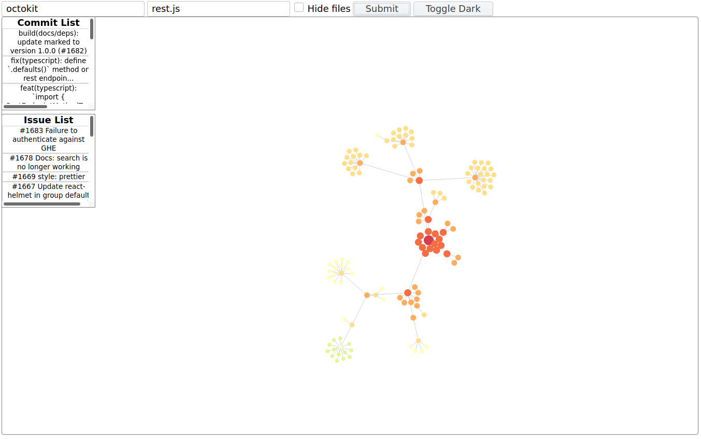

# Visualizing-GitHub
This Repo is for A GitHub visualization tool that we, **@Hatt3n** and **@christian-stj**,
have created for a course that we are undertaking. The purpose of the tool is
to visualize GitHub metadata, such as commits and issues, in a comprehensive
manner.

**Note:** The commit history is shallow because of the fact that we have been working
on the project on a different GitHub platform. We published the project here to make
it available to everyone.
